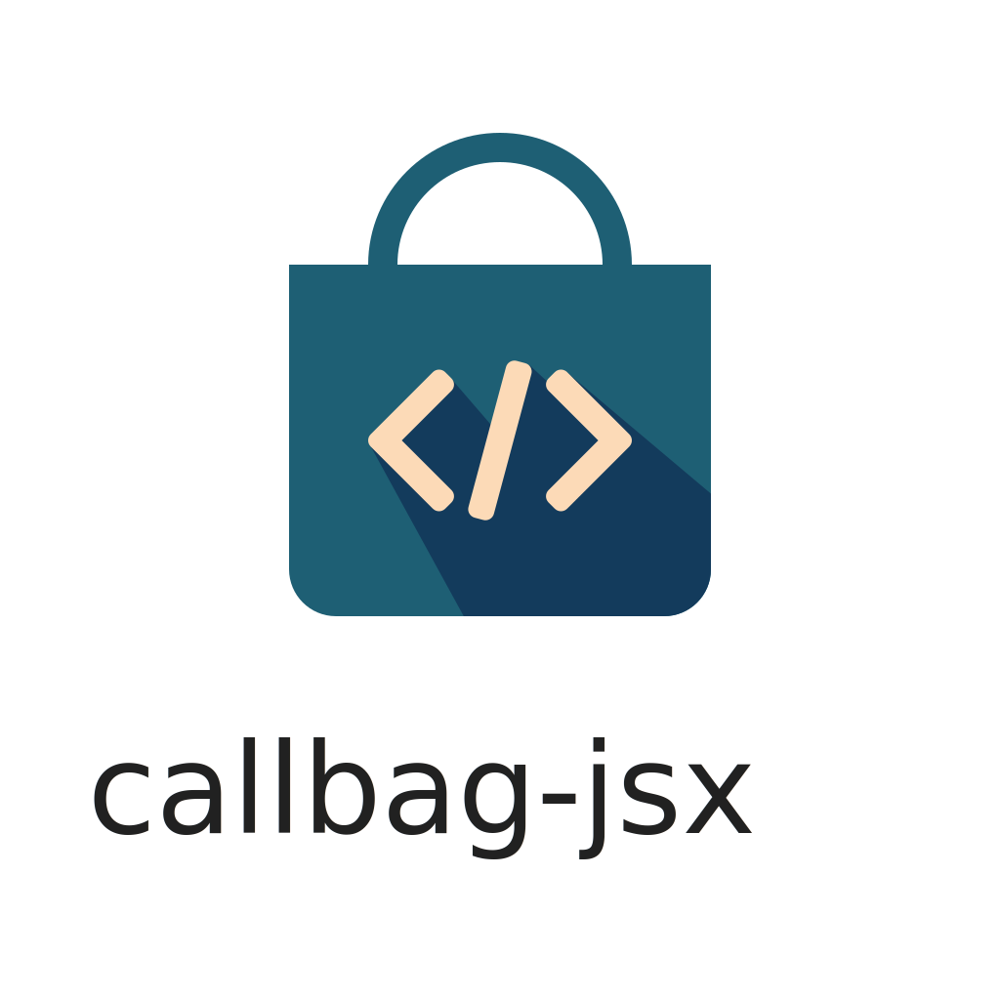

<div align="center"></div>

Callbags + JSX. No virtual DOM, no passive change detection, no compile-time invalidation.

```bash
npm i callbag-jsx
```

👉 Sample Todolist app:

```tsx
import { makeRenderer, List } from 'callbag-jsx';
import { state } from 'callbag-state';

const renderer = makeRenderer();

const todos = state([{title: 'Do this'}, {title: 'Do that'}]);
const next = state('');

const add = () => {
  todos.set(todos.get().concat([{title: next.get()}]));
  next.set('');
};

renderer.render(<div>
  <h1>Todos</h1>
  <ol>
    <List of={todos} each={todo => <li>{todo.sub('title')}</li>}/>
  </ol>
  <input type='text' _state={next} placeholder='What should be done?'/>
  <button onclick={add}>Add</button>
</div>).on(document.body);
```
[►TRY IT!](https://stackblitz.com/edit/callbag-jsx-todolist)

<br><br>

# Why?

🎛️ **Control**: `callbag-jsx` provides convenience of React without taking control away. You can seamlessly control exactly
when and how some part of the DOM tree is updated:

```tsx
const renderer = makeRenderer();
const s = state('');

renderer.render(<>
  <input _state={s} type='text' placeholder='Type something ...'/>
  <br/>
  { s }
  <br/>
  { pipe(s, debounce(200)) }
</>).on(document.body);
```
[►TRY IT!](https://stackblitz.com/edit/callbag-jsx-debounce)

<br>

🗳️ **State Management**: `callbag-jsx` is integrated with [`callbag-state`](https://github.com/loreanvictor/callbag-state), so there is no need for external
state-management tools such as Redux:

```tsx
const renderer = makeRenderer();
const s = state([0, 0, 0, 0]);

renderer.render(<div>
  <List of={s} each={i => 
    <div onclick={() => i.set(i.get() + 1)}>clicked {i} times</div>
  }/>

  <br/>

  State: {expr($ => $(s).join(', '))}
</div>).on(document.body);
```
[►TRY IT!](https://stackblitz.com/edit/callbag-jsx-state-management)

<br>

⚡ **Performance**: there is no virtual DOM, dirty model checking, etc. `callbag-jsx` just binds callbags to DOM elements. As a result:
- It is much faster than most popular frameworks.
- Its bundles are much smaller (so faster to ship).
- No bootstrapping besides your own code, so web-apps are quickly interactive.

|  |  |
| --------------------------------------------------------- | ---------------------------------------------------- |

<sub>Benchmarks conducted using [JS framework benchmark](https://github.com/krausest/js-framework-benchmark).</sub>

<br>

🔮 **Predictability**: There are no [_peculiar hooks rules_](https://reactjs.org/docs/hooks-rules.html), [_compile time invalidation rules_](https://svelte.dev/tutorial/updating-arrays-and-objects), etc. A component is just a function that is called exactly once to render some part of the UI. When you have:

```tsx
function MyComponent(...) {
  const x = <span/>;
  // ...
  return <div>{x}</div>;
}
```

Then `x` IS the span element that ends up on screen (and not a proxy for it). You just need to know JS(X) to fully understand what happens.

<br>

🛠️ **Versatility**: Because of its simplicity, `callbag-jsx` is highly interoperable and robust. You can even manually modify the DOM whenever you need to (for example for obtaining maximum possible performance).

